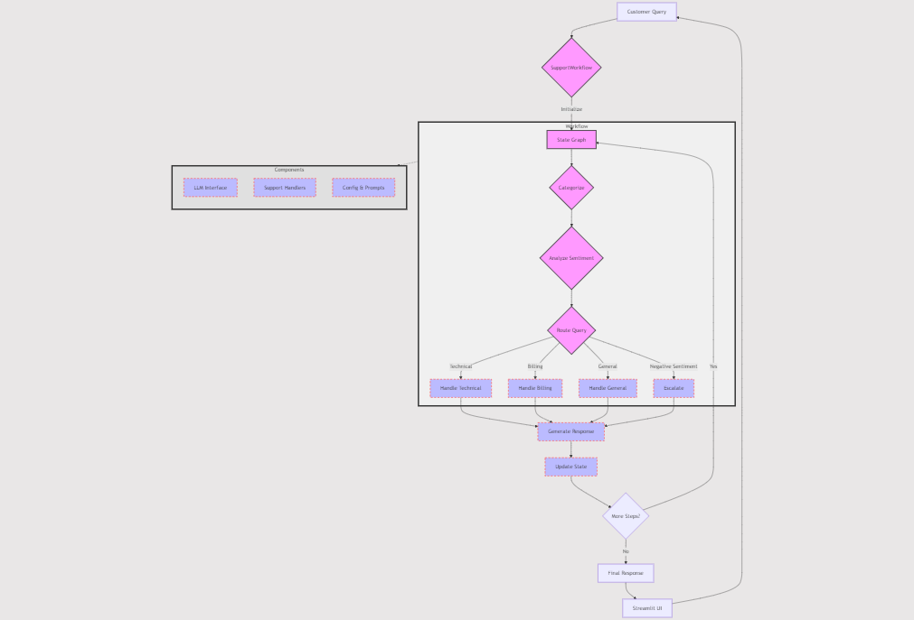

# Hands-On Guide: Effectively Using AI Agents for Customer Query Management 

## Introduction

Full Article : [https://medium.com/@learn-simplified/how-i-built-supply-chain-optimization-using-ai-agents-84339654938c

## TL;DR:

This article showcases a practical AI-powered customer support system. We've built a workflow that automatically categorizes queries, analyzes sentiment, and provides appropriate responses. It's a real-world example of how AI can streamline support operations, improve efficiency, and enhance customer satisfaction. 
Whether you're a business owner or tech enthusiast, you'll see how AI can be applied to solve everyday business challenges. The future of customer support is AI-driven, and this article gives you a glimpse into that future.


## Whats This Project About

This article explores the implementation of an AI-driven customer support system. We've created a streamlined workflow that takes a customer's query, analyzes its content and sentiment, and routes it to the appropriate handler - all in a matter of seconds. 
The system categorizes queries, understands the customer's emotional state, and can even escalate issues when necessary. It's a practical demonstration of how AI can be integrated into real-world business processes to enhance efficiency and customer satisfaction.

## Why Work on It?

In today's fast-paced business environment, AI isn't just a buzzword - it's a game-changer. This article shows you, through a concrete example, how AI can be harnessed to revolutionize customer support. While our company is fictional, the techniques and technologies discussed are very real and applicable. You'll see how AI can categorize queries, analyze sentiment, and provide tailored responses, all while maintaining a smooth, intuitive user interface. 
Whether you're a business owner looking to improve your support processes, a developer interested in AI applications, or just curious about the future of customer service, this article offers valuable insights into the practical implementation of AI in business operations.


## Architecture



# Tutorial: Effectively Using AI Agents for Customer Query Management 

## Prerequisites
- Python installed on your system.
- A basic understanding of virtual environments and command-line tools.

## Steps

1. **Virtual Environment Setup:**
   - Create a dedicated virtual environment for our project:
   
     ```bash
     python -m venv Effectively-Using-AI-Agents-for-Customer-Query-Management
     ```
   - Activate the environment:
   
     - Windows:
       ```bash
       Effectively-Using-AI-Agents-for-Customer-Query-Management\Scripts\activate
       ```
     - Unix/macOS:
       ```bash
       source Effectively-Using-AI-Agents-for-Customer-Query-Management/bin/activate
       ```
   
# Installation and Setup Guide

**Install Project Dependencies:**

Follow these steps to set up and run the 'Hands-On Guide: Effectively Using AI Agents for Customer Query Management' project:

1. Navigate to your project directory:
   ```
   cd path/to/your/project
   ```
   This ensures you're in the correct location for the subsequent steps.

2. Install the required dependencies:
   ```
   pip install -r requirements.txt
   ```
   This command installs all the necessary Python packages listed in the requirements.txt file.


## Run - Hands-On Guide: Effectively Using AI Agents for Customer Query Management

   ```bash 
     
      # Run 
      streamlit run app.py
      
   ```


